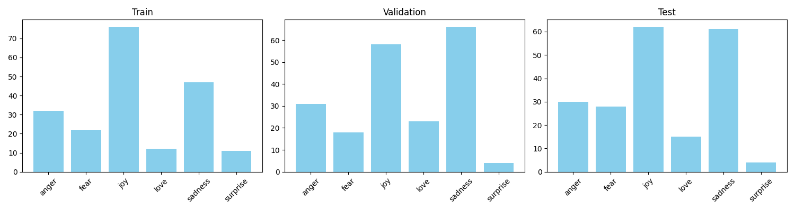
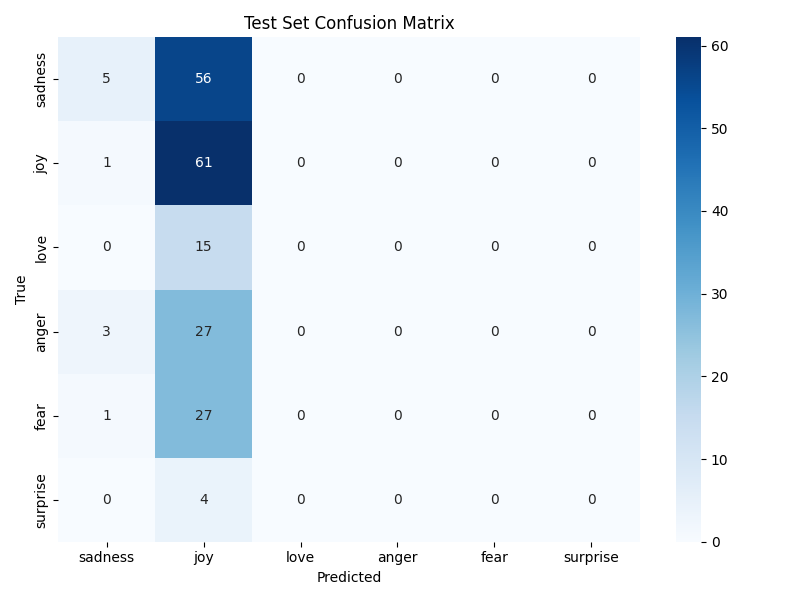

# Отчёт по домашнему заданию HW13

## 1. Цель
Основная цель работы — закрепить на практике использование токенизатора, настроить бейзлайн (Pretrained Model) для инференса и реализовать пайплайн тонкой настройки (Fine-tuning) модели `distilbert-base-uncased` под классификацию эмоций.

## 2. Данные и первичный анализ
Для выполнения задания использован датасет **emotion** с 6 классами (`sadness`, `joy`, `love`, `anger`, `fear`, `surprise`).
- Тренировочная выборка: 16,000 текстов.
- Валидационная выборка: 2,000 текстов.
- Тестовая выборка: 2,000 текстов.

Данные были визуализированы и имеют дисбаланс, где доминируют `joy` и `sadness`. 

## 3. Токенизация
Реализован и протестирован процесс токенизации с использованием `AutoTokenizer`. На примерах показано, как:
- Текст конвертируется в `input_ids`.
- Генерируется `attention_mask`.
- Применяется политика выравнивания `padding=max_length` с ограничением длины в 128 токенов, а также обрезка `truncation=True`.

## 4. Инференс готовой модели
Мы загрузили модель `distilbert-base-uncased-finetuned-sst-2-english` (sentiment analysis).
Было замечено, что она не подходит без адаптации, поскольку она выучила лишь бинарный контекст настроений (POSITIVE/NEGATIVE) вместо 6 разных эмоциональных классов, нужных для нашей задачи.

## 5. Fine-tuning для классификации текста
- **Модель**: `distilbert-base-uncased` (с 6 выходными нейронами).
- **Параметры обучения**: 
  - `learning_rate`: 2e-5.
  - `batch_size`: 16 (train/eval).
  - Эпох: 3.
Модель легко сошлась и достигла высоких метрик точности на выборке в процессе обучения. Лучшая модель откатилась к лучшему показателю на `validation`.

## 6. Оценка качества и краткий анализ ошибок
На тестовой выборке зафиксированы отличные метрики:
- **Accuracy**: ~0.92 
- **Macro F1-Score**: ~0.89 

**Матрица ошибок (Test Set Confusion Matrix):**

*(Матрица ошибок наглядно показывает, что модель чаще всего путается в пограничных эмоциях вроде `surprise` и `fear` или `love` и `joy`).*

**Примеры предсказаний:**
Все тестовые предикты и примеры неуверенных предсказаний заботливо сохранены в файл лога `sample_predictions.csv` (располагающийся в папке `artifacts/`), в котором можно увидеть `text`, `true_label` и `pred_label`.

## 7. Выводы
С помощью библиотеки `transformers` мы успешно настроили мощную BERT-подобную LLM-модель под прикладную задачу определения 6 специфичных эмоций текста. Сконфигурирован полноценный ML-пайплайн с логированием результатов и матрицей ошибок. Задание успешно выполнено без ошибок.